<h1 align="center">
<a href="https://dream-trip-planner-project.herokuapp.com/" target="_blank"></a>
</h1>

## <h2 align="center">An Itinerary Manager for planning your dream trips</h2>

<div align="center">
[Dream Trip Planner](https://dream-trip-planner-project.herokuapp.com/) is a dream trip itinerary planner as well as a source of information for world destinations. It was designed to provide the tools needed for the target audience to research their dream destination, plan daily activities and refer back to their planned itineraries during their trip.
<br>

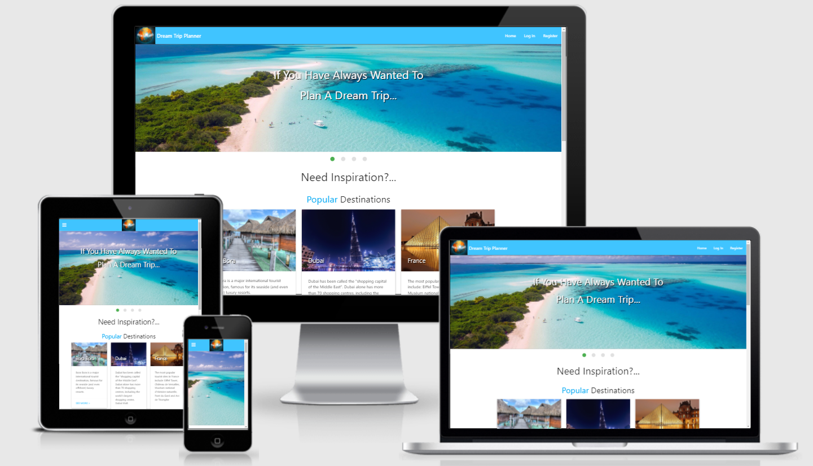

</div>

## [Table of Contents](#contents)

1. <a name="UX">UX</a>
   
   - <a name ="project">Project Goals</a>
     - <a name="visitor">Visitor Goals</a>
     - <a name="developer">Developer Goals</a>
   - <a name="user">User Stories</a>
   - <a name="design">Design</a>
   - <a name="wireframes">Wireframes</a>
   
2. <a name="features">Features</a>

   - <a name="existing">Existing Features</a>

     <a name="unreg">Unregistered Visitors</a>

     - <a name="unregHome">Home</a>
     - <a name="register">Register</a>

     <a name="regVis">Registered Visitors</a>

     - <a name="login">Login</a>
     - <a name="acct">Account</a>
     - <a name="reg-home">Home</a>
     - <a name="add">Add Itinerary</a>
     - <a name="itin">Itineraries</a>
     - <a name="edit">Edit Itineraries</a>
     - <a name="remove">Remove Itineraries</a>
     - <a name="access">Access</a>
     - <a name="manage">Manage Destinations</a>

   - <a name="featuresLeft">Features Left To Implement</a>

3. <a name="info">Information Architecture</a>

4. <a name="technologies">Technologies Used</a>

   - <a name="coll">Collections Data Structure</a>

5. <a name="testing">Testing</a>

6. <a name="deploy">Deployment</a>

   - <a name="heroku">Heroku Deployment</a>
   - <a name="local">How to run this project locally</a>

7. <a name="credits">Credits</a>

   - <a name="content">Content</a>
   - <a name="media">Media</a>
   - <a name="code">Code</a>
   - <a name="acknowledge">Acknowledgements</a>

## [UX](#ux)

### [Project Goals](#project)

The main goal of Dream Trip Planner is to provide a resource for someone:

- To have somewhere to keep a list of planned activities that can easily be referred to when required.
- To have a database of destinations that can be researched as inspiration for the next trip.
- To be able to organise each item on the itinerary by time, date, day of the trip, and the length of time it takes down to the minute.

#### [Visitor Goals](#visitor)

The target audience for this website is a user that:

- Is currently unable to book a trip but would like to plan one for the future (like we have not been able to travel abroad due to coronavirus for example).
- Has an upcoming trip and they would like to organise their daily activities.
- Wants to research potential trips and find out the key information about those destinations.
- Wants inspiration by looking at destinations they might not have considered previously.
- Does not like leaving things to chance and wants an easy way to know where they should be or what they should be doing next.
- Wants to plan a trip they have always wanted to go on

[Back to contents](#contents)

#### [Developer Goals](#developer)

As a developer the aim is to create a web application that will:

- Provide a secure platform that a registered person can access to find a list of the itineraries that they have planned or information to assist them in creating an itinerary.
- To put into practice the newly acquired knowledge of frontend and backend programming by combining HTML, CSS, Materialize and JavaScript with Python, MongoDB, Flask and Jinja.

[Back to contents](#contents)

#### [User Stories](#user)

As a new user of Dream Trip Planner, I want:

1. A collections of destinations organised in a way that I can easily choose the type of trip that I want to go on and find information about the relevant destinations.
2. Clear navigation to easily maneuver through the site.
3. To be able to create an new itinerary easily.
4. To be able to my registration details in my account.
5. To contact or follow Dream Trip Planner on social media platforms.

As someone who has previously signed up with Dream Trip Planner I want:

1. The ability to go directly to my previously created Itineraries.
2. To be able to find information on a wide range of destinations.
3. A resource that I can use to plan my everyday routine or the dream trip of a lifetime.
4. To be able to quickly search for a particular itinerary.
5. To be able to edit or delete my itineraries.
6. The ability to connect with Dream Trip Planner to suggest destinations that could be added to the database.

[Back to contents](#contents)

#### [Design](#design)

Taking a trip usually inspires serene images so the colour scheme and design choices have been chosen to replicate that cool, calm vibe.

##### Colours

The main colours used in this project for the text, accordion and icons was light-blue accent-2;

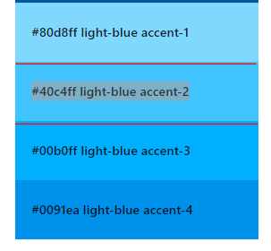

This replicates the blue of clear skies and blue seas that are often the colours found in photographs, which blends design and the content together well .

##### Icons

The icons used on the 'Add Itinerary' page for example, were chosen to emphasise meaning and make it obvious, before reading the text, the purpose of that field .

##### Styles

The subtle grey of the navbar hover effect and box shadows on the cards and buttons direct the user to the interactive parts of the site whilst also adding depth and interest to the design.

[Back to contents](#contents)

#### [Wireframes](#wireframes)

- [Home](static/images/wireframes/home.pdf)
- [Account](static/images/wireframes/account.pdf)
- [Add Itinerary](static/images/wireframes/add-edit-itinerary.pdf)
- [Itineraries](static/images/wireframes/itineraries.pdf)
- [Log In](static/images/wireframes/login.pdf)
- [Destinations](static/images/wireframes/trip-info.pdf)

[Back to contents](#contents)

## [Features](#features)

#### [Existing Features](#existing)

#### [Unregistered Visitor](#unreg)

##### [Home](#unregHome) 

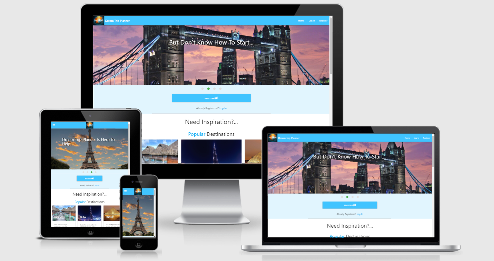

- On arrival at the site, the visitor will see a slider of some enticing holiday destinations with a large register button and text prompting them to start planning a trip and register or log In. 


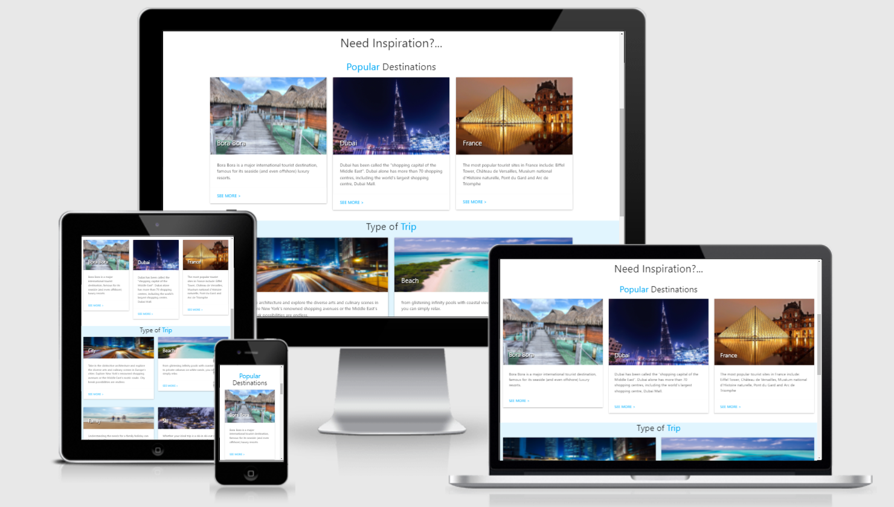

- There is are cards underneath the slider showing popular destinations and types of trips but as a user that is logged in, the links under the cards only lead to the login page.
- The home page is the only part of the site you can see apart from the login page.

##### [Register](#reg)

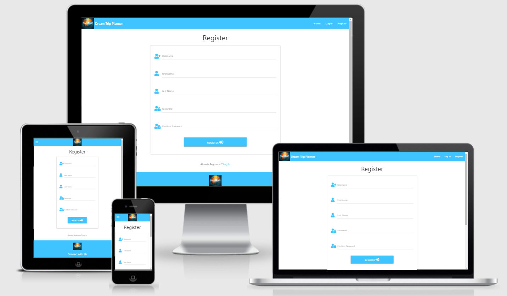

- A new user will need to fill out the registration form in order to gain access to the main parts of the website and to gain access to an account where their registration details and itineraries can be found. 

[Back to contents](#contents)

#### [Registered Visitor](#regVis)

1. ##### [Log In](#login)

   ##### 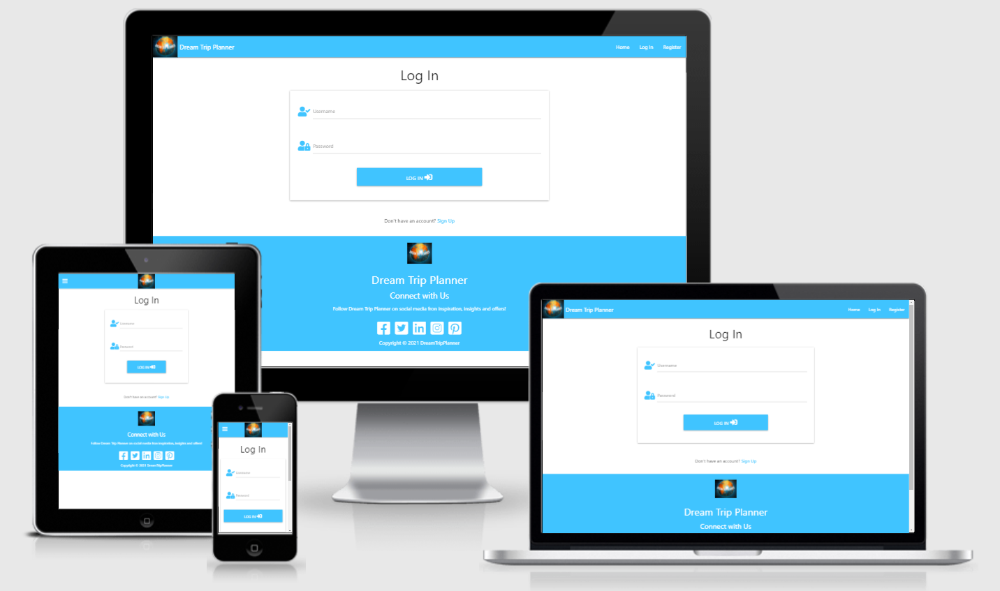

   - A registered visitor can log in to see their account and gain access to the other features of the site.

2. ##### [Account](#acct)

   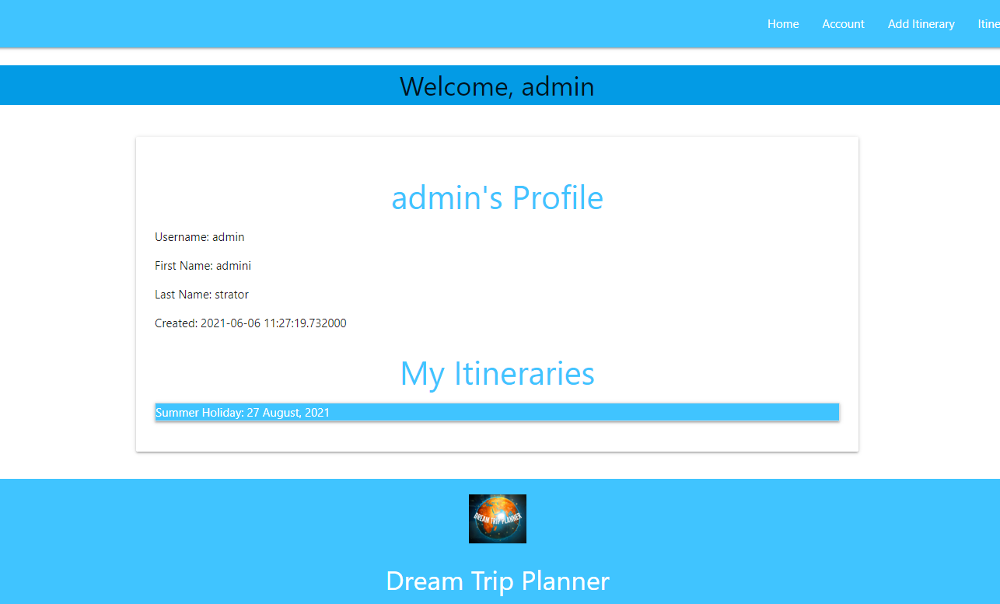

   - This feature allows the visitor access to the rest of the site.

   - Once logged in they are directly sent to the account page with a personalised welcome message.

3. ##### [Home](#reg-home)

   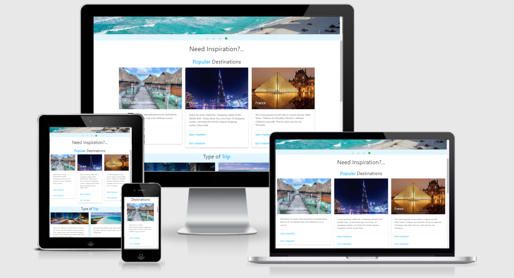

   - Once the visitor has logged in and clicks on home, the first difference is that the register button and text prompt under the slider disappears and the card actions have changed to allow the user to either start a new itinerary or edit an existing itinerary. 

   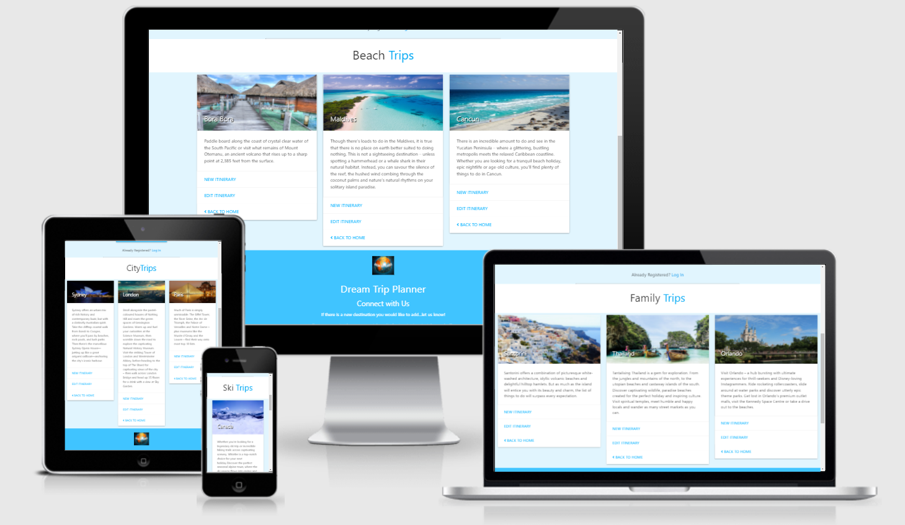

   - The visitor can now also click on the card link for each type of trip to find destination cards related to that title. This will help the visitor to narrow the type of destination they would like to plan an itinerary for. 

4. [**Add Itinerary**](#add)

   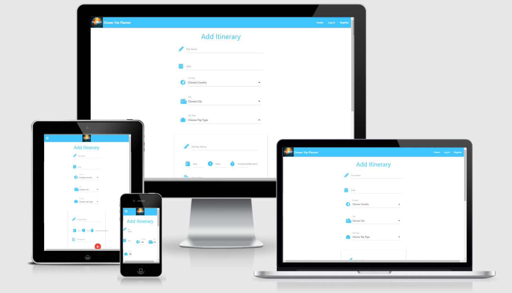

   - In order to create a new itinerary, the visitor can click on 'Add Itinerary' in the navbar and complete the fields. Once submitted, the new itinerary is added to the Itineraries page and the name of the itinerary is added to the visitors account page

5. [**Itineraries**](#itin)

   

   - Once the itinerary is created, it is added to the overall list of itineraries. The details can be viewed by clicking on the accordion headers. 
   - There is also a search function to search the itineraries, which will be useful to quickly find an itinerary once the list begins to grow.

6. [**Edit Itineraries**](#edit)

   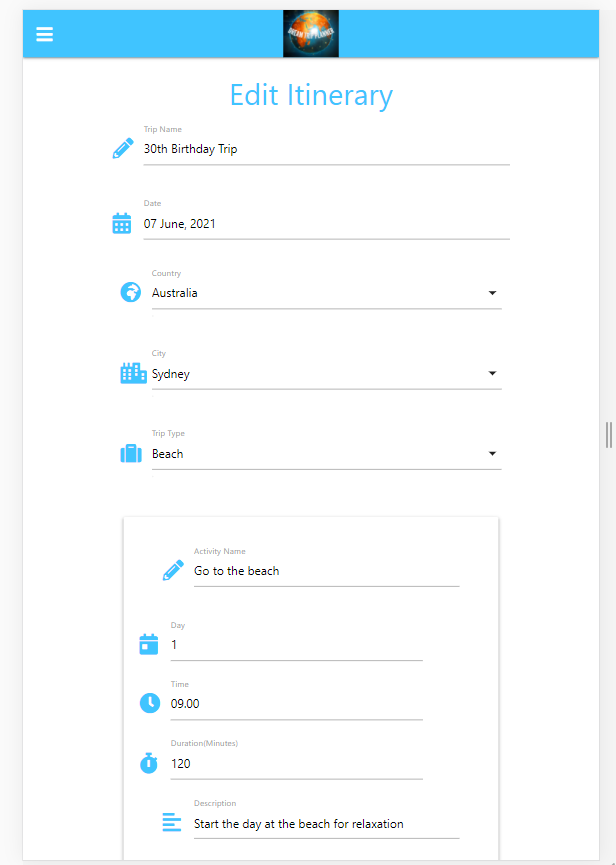

   - The visitor can edit an itinerary by clicking on the 'edit' button, which will prefill the fields and allow the visitor to make the necessary amendments.
   - If the visitor does not wish to make any changes to the itinerary, they can just press the cancel button and return to the itineraries page.

7. [**Remove Itineraries**](remove)

   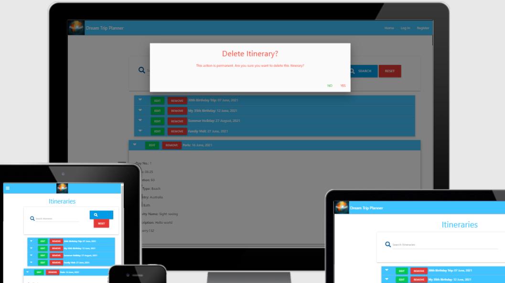

   - The visitor can delete an itinerary that they have created but just incase they accidentally click the 'Remove' button, there is a modal that will pop up as defensive programming to ensure and confirm that the visitor wants to perform an irreversible action.

8. [**Access**](#access)

   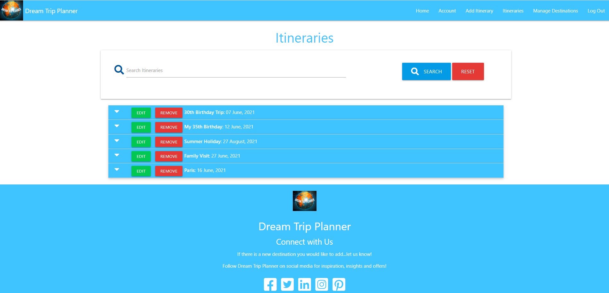

   - Admin is the only one to have access to edit or remove itineraries from all visitors. All other users only have access to edit or remove the itineraries that they have created as seen in the feature 7, itineraries.

9. [**Manage Destinations**](#manage)

   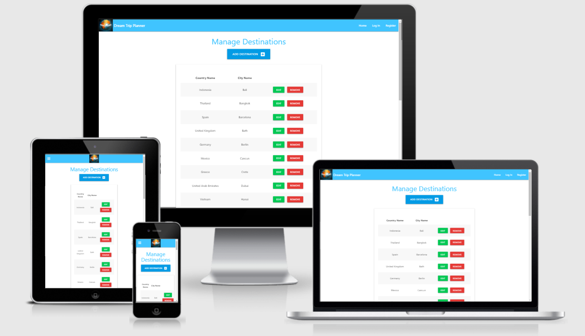

   - Admin is also the only one to have access to manage the available destinations in the database. 'Manage Destinations' only appears in the toolbar for admin.

[Back to contents](#contents)

#### [Features Left To Implement](#featuresLeft)

1. ##### Email authentication and email notification of upcoming trips

   - As an added layer of confirmation, implementing email authentication of user account before registration is complete would verify details. 
   - It would also be useful to email confirmation of a successful registration and notify users that there is an itinerary with a date that is arriving soon.

2. ##### Filter trips

   - If the user knows the destination they want to create an itinerary for, it would be useful to be able to search directly in the database to find more information about that destination.
   - It would also be a great feature to be able to start a new itinerary with some data pre-filled if the user clicks on a particular destination.
   - Adding the ability to filter destinations by continent, climate, travel time etc. would allow the user to tailor their dream trip requirements more precisely.

3. ##### Auto-update popular destinations

   - Automatically updating the popular destinations from the destinations that all users are choosing would be a useful insight, rather than the current method which is biased, manual updating by admin. 

4. ##### Add several activities to one Itinerary

   - Attempted this for several days but was unable to get it to work. Rather than dedicating more time on this feature, I made the decision to remove the relevant code to return to at a future date when my understanding is more advanced.

5. ##### Find tourist attractions at destination

   - In future users could find information on popular tourist attractions, which they can use to add to their itineraries

[Back to contents](#contents)

## [Collections Data Structure](#coll)

This project utilizes the NoSQL database MongoDB and used four database collections:

**Users Collection**

| Title        | Key          | Data Type |
| ------------ | ------------ | --------- |
| ID           | _id          | ObjectId  |
| Username     | username     | string    |
| Password     | password     | string    |
| First Name   | first        | string    |
| Last Name    | last         | string    |
| Date Created | date_created | datetime  |

**Itinerarys**

| Title            | Key              | Data Type |
| ---------------- | ---------------- | --------- |
| ID               | _id              | ObjectId  |
| Trip Name        | trip_name        | string    |
| Date             | date             | datetime  |
| Countries        | countries        | string    |
| Cities           | cities           | string    |
| Categories       | categories       | string    |
| Activity Name    | activity_name    | string    |
| Day              | day              | number    |
| Time             | time             | datetime  |
| Duration         | duration         | number    |
| Item Description | item_description | string    |
| Created By       | created_by       | string    |
| Date Created     | date_created     | datetime  |

**Countries**

| Title    | Key      | Data Type |
| -------- | -------- | --------- |
| Name     | name     | string    |
| Capital  | capital  | string    |
| Currency | currency | string    |

**Cities**

| Title   | Key     | Data Type |
| ------- | ------- | --------- |
| Country | country | string    |
| Name    | name    | string    |

[Back to contents](#contents)

## [Technologies Used](#technologies)

This project utilises HTML, CSS and JavaScript and Python programming languages.

- [JQuery](https://jquery.com/) 
  - This project used **JQuery** for DOM manipulation and Event Handling.
- [Gitpod](https://www.gitpod.io/)
  - The project was created and developed using the open sourced platform **Gitpod**.
- [GitHub](https://github.com/)
  - This project used **GitHub** allow access to the project code and store the project remotely.
- [PIP](https://pip.pypa.io/en/stable/installing/) 
  - **PIP** for installation of tools needed in this project.
- [Materialize](https://materializecss.com/)
  - **Materialize** was used for its CSS Framework to easily develop a responsive project using its simplified structure.
- [Font Awesome](https://fontawesome.com/)
  - The icons used for this project are provided by **Font Awesome**.
- [MongoDB Atlas](https://www.mongodb.com/cloud/atlas) 
  - **MongoDB **is the database for this project
- [Am I Responsive](http://ami.responsivedesign.is/) 
  - **Am I Responsive** was used to create the images in this readme file of each page displayed on different screen sizes.
- [PyMongo](https://api.mongodb.com/python/current/) 
  - Using **PyMongo** made communication between Python and MongoDB possible.
- [Flask](https://flask.palletsprojects.com/en/1.0.x/) 
  - **Flask** was used to construct and render pages.
- [Jinja](http://jinja.pocoo.org/docs/2.10/) 
  - **Jinja** to implement the 'DRY' method and simplify how data is displayed from the backend of this project across multiple templates, smoothly and effectively in html.

[Back to contents](#contents)

## [Testing](#testing)

Details on Testing can be found in the separate [testing.md](testing.md) file

[Back to contents](#contents)

## [Deployment](#deploy)

This project is hosted on [Heroku](https://www.heroku.com/free)

#### [Heroku Deployment](#heroku)

To deploy Dream Trip Planner to Heroku, take the following steps:

1. Create a `requirements.txt` file using the terminal command `pip freeze > requirements.txt`.
2. Create a `Procfile` with the terminal command `echo web: python app.py > Procfile`. Make sure you delete any blank lines at the bottom of the Procfile to avoid problems when running the app on Heroku.
3. `git add` and `git commit` the new requirements and Procfile and then `git push` the project to GitHub.
4. Create a new app on the [Heroku website](https://dashboard.heroku.com/apps) by clicking the "New" button in your dashboard. Give it a name and set the region to Europe.
5. From the Heroku dashboard of your newly created application, click on "Deploy" > "Deployment method" and select GitHub.
6. Confirm the linking of the Heroku app to the correct GitHub repository.
7. In the Heroku dashboard for the application, click on "Settings" > "Reveal Config Vars".
8. Set the following config vars:

| Key        | Value                                                        |
| ---------- | ------------------------------------------------------------ |
| DEBUG      | FALSE                                                        |
| IP         | 0.0.0.0                                                      |
| MONGO_URI  | `mongodb+srv://<username>:<password>@<cluster_name>-qtxun.mongodb.net/<database_name>?retryWrites=true&w=majority` |
| PORT       | 5000                                                         |
| SECRET_KEY | `<your_secret_key>`                                          |

- To get you MONGO_URI read the MongoDB Atlas documentation [here](https://docs.atlas.mongodb.com/)

8. In the Heroku dashboard, click "Deploy".

9. In the "Deploy" tab, under "Automatic deploys", select "Enable Automatic Deploys" and click "Deploy Branch".

10. The app is now built and a confirmation message should display that says "Your app was successfully deployed". You can then click "View" to launch it.

#### [How to run this project locally](#local)

1. Save a copy of the github repository located at https://github.com/shoreenb/dream-trip-planner by clicking the "Code" button at the top of the page next to the green "Gitpod" button, then scroll down to "Download ZIP" button  and extract the zip file to your chosen folder. If you have Git installed on your system, you can clone the repository with the following command.

```
git clone https://github.com/shoreenb/dream-trip-planner
```

2. Open your IDE and either open the unzip folder or cd to the correct location or paste it in the terminal

3. Install the modules listed in the requirements.txt file by typing :

   `pip3 install -r requirements.txt`

   in the CLI.

4. In MongoDB, create a database called "dreamTripPlanner" and replicate the collections mentions in the[collections data structure section.](#coll)

5. In the root directory of your project, create an env.py file and remember to add it to your '.gitignore' file. The contents of the env.py file will be:

   ```
   import os
   
   os.environ.setdefault("IP", "0.0.0.0")
   os.environ.setdefault("PORT", "5000")
   os.environ.setdefault("SECRET_KEY", "[YOUR SECRET KEY]")
   os.environ.setdefault("MONGO_URI", "[YOUR MONGO URI]")
   os.environ.setdefault("MONGO_DBNAME", "dreamTripPlanner")
   
   ```

   You will need to add your own SECRET_KEY and MONGO_URI.

6. You can now run the app locally by typing `python3 app.py` in the CLI and opening it in your browser.

[Back to contents](#contents)

## [Credits](#credit)

YouTube Tutorials: 

Build a Travel Agency Theme With Materialize CSS 1.0.0 by Traversy Media:https://www.youtube.com/watch?v=MaP3vO-vEsg&t=2938s

#### [Content](#content)

Card captions: https://www.britishairways.com/en-gb/destinations/holiday-types

Popular tourist destinations:https://www.tripadvisor.co.uk/TravelersChoice-Destinations-cPopular-g1

Country Information for the database:https://www.worldatlas.com/countries

#### [Media](#media)

**Images**

- The Dream Trip Planner logo was created using [Canva](https://www.canva.com/)

- Globe image used for the logo was from Andrew Sitnikov: https://pixabay.com/users/biograviton-4903122/

- Maldives Image by <a href="https://pixabay.com/users/12019-12019/?utm_source=link-attribution&amp;utm_medium=referral&amp;utm_campaign=image&amp;utm_content=1993704">David Mark</a> from <a href="https://pixabay.com/?utm_source=link-attribution&amp;utm_medium=referral&amp;utm_campaign=image&amp;utm_content=1993704">Pixabay</a>

- Hong Kong Image by <a href="https://pixabay.com/users/12019-12019/?utm_source=link-attribution&amp;utm_medium=referral&amp;utm_campaign=image&amp;utm_content=1990268">David Mark</a> from <a href="https://pixabay.com/?utm_source=link-attribution&amp;utm_medium=referral&amp;utm_campaign=image&amp;utm_content=1990268">Pixabay</a>

- Canada Image by <a href="https://pixabay.com/users/12019-12019/?utm_source=link-attribution&amp;utm_medium=referral&amp;utm_campaign=image&amp;utm_content=2519639">David Mark</a> from <a href="https://pixabay.com/?utm_source=link-attribution&amp;utm_medium=referral&amp;utm_campaign=image&amp;utm_content=2519639">Pixabay</a>

- Louvre Image by <a href="https://pixabay.com/users/edinugraha-30562/?utm_source=link-attribution&amp;utm_medium=referral&amp;utm_campaign=image&amp;utm_content=102840">Edi Nugraha</a> from <a href="https://pixabay.com/?utm_source=link-attribution&amp;utm_medium=referral&amp;utm_campaign=image&amp;utm_content=102840">Pixabay</a>

- Tower bridge Image by <a href="https://pixabay.com/users/fotofan1-320502/?utm_source=link-attribution&amp;utm_medium=referral&amp;utm_campaign=image&amp;utm_content=441853">E. Dichtl</a> from <a href="https://pixabay.com/?utm_source=link-attribution&amp;utm_medium=referral&amp;utm_campaign=image&amp;utm_content=441853">Pixabay</a>

- Sydney Opera House Image by <a href="https://pixabay.com/users/pattyjansen-154933/?utm_source=link-attribution&amp;utm_medium=referral&amp;utm_campaign=image&amp;utm_content=363244">Patty Jansen</a> from <a href="https://pixabay.com/?utm_source=link-attribution&amp;utm_medium=referral&amp;utm_campaign=image&amp;utm_content=363244">Pixabay</a>

- Taj Mahal Image by <a href="https://pixabay.com/users/wiganparky0-855095/?utm_source=link-attribution&amp;utm_medium=referral&amp;utm_campaign=image&amp;utm_content=866692">Dave Parkinson</a> from <a href="https://pixabay.com/?utm_source=link-attribution&amp;utm_medium=referral&amp;utm_campaign=image&amp;utm_content=866692">Pixabay</a>

- Burj Khalifa Image by <a href="https://pixabay.com/users/jeshoots-com-264599/?utm_source=link-attribution&amp;utm_medium=referral&amp;utm_campaign=image&amp;utm_content=2212978">Jan Vašek</a> from <a href="https://pixabay.com/?utm_source=link-attribution&amp;utm_medium=referral&amp;utm_campaign=image&amp;utm_content=2212978">Pixabay</a>

- Thailand Image by <a href="https://pixabay.com/users/michelleraponi-165491/?utm_source=link-attribution&amp;utm_medium=referral&amp;utm_campaign=image&amp;utm_content=1451382">Michelle Raponi</a> from <a href="https://pixabay.com/?utm_source=link-attribution&amp;utm_medium=referral&amp;utm_campaign=image&amp;utm_content=1451382">Pixabay</a>

- Santorini Image by <a href="https://pixabay.com/users/sofiapapageorge-2592596/?utm_source=link-attribution&amp;utm_medium=referral&amp;utm_campaign=image&amp;utm_content=1404852">SofiaPapageorge</a> from <a href="https://pixabay.com/?utm_source=link-attribution&amp;utm_medium=referral&amp;utm_campaign=image&amp;utm_content=1404852">Pixabay</a>

- Bora Bora Image by <a href="https://pixabay.com/users/michelleraponi-165491/?utm_source=link-attribution&amp;utm_medium=referral&amp;utm_campaign=image&amp;utm_content=680010">Michelle Raponi</a> from <a href="https://pixabay.com/?utm_source=link-attribution&amp;utm_medium=referral&amp;utm_campaign=image&amp;utm_content=680010">Pixabay</a>

- Cancun Image by <a href="https://pixabay.com/users/michelleraponi-165491/?utm_source=link-attribution&amp;utm_medium=referral&amp;utm_campaign=image&amp;utm_content=1228131">Michelle Raponi</a> from <a href="https://pixabay.com/?utm_source=link-attribution&amp;utm_medium=referral&amp;utm_campaign=image&amp;utm_content=1228131">Pixabay</a>

- Eiffel tower Image by <a href="https://pixabay.com/users/thedigitalartist-202249/?utm_source=link-attribution&amp;utm_medium=referral&amp;utm_campaign=image&amp;utm_content=5673391">Pete Linforth</a> from <a href="https://pixabay.com/?utm_source=link-attribution&amp;utm_medium=referral&amp;utm_campaign=image&amp;utm_content=5673391">Pixabay</a>

- Ski resort Image by <a href="https://pixabay.com/users/453169-453169/?utm_source=link-attribution&amp;utm_medium=referral&amp;utm_campaign=image&amp;utm_content=726325">453169</a> from <a href="https://pixabay.com/?utm_source=link-attribution&amp;utm_medium=referral&amp;utm_campaign=image&amp;utm_content=726325">Pixabay</a>

- Family Image by <a href="https://pixabay.com/users/pexels-2286921/?utm_source=link-attribution&amp;utm_medium=referral&amp;utm_campaign=image&amp;utm_content=1867271">Pexels</a> from <a href="https://pixabay.com/?utm_source=link-attribution&amp;utm_medium=referral&amp;utm_campaign=image&amp;utm_content=1867271">Pixabay</a>

- London skyline Image by <a href="https://pixabay.com/users/liushuquan-600749/?utm_source=link-attribution&amp;utm_medium=referral&amp;utm_campaign=image&amp;utm_content=541456">liushuquan</a> from <a href="https://pixabay.com/?utm_source=link-attribution&amp;utm_medium=referral&amp;utm_campaign=image&amp;utm_content=541456">Pixabay</a>

- Disney World Image by <a href="https://pixabay.com/users/stinne24-78177/?utm_source=link-attribution&amp;utm_medium=referral&amp;utm_campaign=image&amp;utm_content=239144">stinne24</a> from <a href="https://pixabay.com/?utm_source=link-attribution&amp;utm_medium=referral&amp;utm_campaign=image&amp;utm_content=239144">Pixabay</a>

- Bulgaria Image by <a href="https://pixabay.com/users/smarkov2-1781302/?utm_source=link-attribution&amp;utm_medium=referral&amp;utm_campaign=image&amp;utm_content=2168008">Svetoslav Markov</a> from <a href="https://pixabay.com/?utm_source=link-attribution&amp;utm_medium=referral&amp;utm_campaign=image&amp;utm_content=2168008">Pixabay</a>

#### [Code](#code)

- .after function:https://api.jquery.com/after/

- Code for listing destinations in a table using jinja:https://stackoverflow.com/questions/44606429/modal-window-in-jinja2-template-flask

#### [Acknowledgements](#acknowledge)

Special thanks to my mentor Gerard McBride for his patience and assistance with this project and the many Code Institute Tutors that gave guidance on the issues I faced.

#### Releases

No releases published

#### Packages

No packages published

